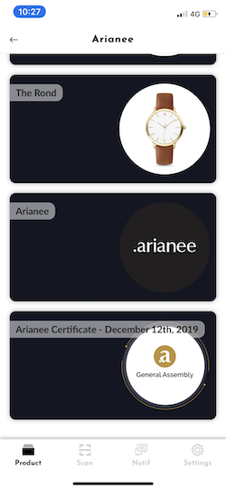

## Json Schema

JSON Schema describes Arianee Identity structure content : https://cert.arianee.org/version1/ArianeeBrandIdentity-i18n.json
    
Identity describes information about a proven identity on Arianee Network.

It defines text information about a company, but also all graphics assets and some technical information.


## Identity example
An identity is mandatory to issue an authentic certificate.

A certificate example linked to a validated identity (Arianee)


#### To view the certificate using Arianee Wallet  
[https://arian.ee/42973,lm742oxett10](https://arian.ee/42973,lm742oxett10)

or scan this QR Code


#### To view raw json 
[brandIdentity.json](brandidentity.json)


#### Identity render in Arianee Wallet

<div style='float: left; margin-right: 10px'>


</div>

<div style='float: left; margin-right: 10px'>


</div>

<div style='float: left; margin-right: 10px'>


</div>

<div style='float: left; margin-right: 10px'>


</div>

<div style='clear: both'>
</div>


## Identity structure walkthrough

### $Schema : URL to related json schema
<!--DOCUSAURUS_CODE_TABS-->
<!--JSON-->
```
{
    "$schema":"https://cert.arianee.org/version1/ArianeeBrandIdentity-i18n.json",
...
```

<!--JSON SCHEMA-->
```
{
    "$id": "https://cert.arianee.org/version1/ArianeeBrandIdentity-i18n.json",
    "$schema": "https://cert.arianee.org/version1/ArianeeBrandIdentity-i18n.json",
    "title": "Arianee Brand Identity",
    "description": "Describing an Arianee Brand Identity.",
    "type": "object",
    "properties": {
      "$schema": {
        "title": "$schema",
        "type": "string",
        "default": "https://cert.arianee.org/version1/ArianeeBrandIdentity-i18n.json",
        "widget": "hidden"
      },
...  
```
<!--END_DOCUSAURUS_CODE_TABS-->
<br/>
<br/>


### name : Identity name
Name of the Brand.
Likely to be one of the first things displayed on a wallet app.
<!--DOCUSAURUS_CODE_TABS-->
<!--JSON-->
```
...
    "name":"Arianee",
...
```

<!--JSON SCHEMA-->
```
...
      "name": {
        "type": "string",
        "title": "Brand Name",
        "description": "Name of the Brand.\n Likely to be one of the first things displayed on a wallet app."
      },
...  
```
<!--END_DOCUSAURUS_CODE_TABS-->

<br/>
<br/>


### companyName : Identity company name
Name of the Company who owns the Brand.
<!--DOCUSAURUS_CODE_TABS-->
<!--JSON-->
```
...
    "companyName":"Arianee",
...
```

<!--JSON SCHEMA-->
```
...
      "companyName": {
        "type": "string",
        "title": "Company Name",
        "description": "Name of the Company who owns the Brand."
      },
...  
```
<!--END_DOCUSAURUS_CODE_TABS-->


> Currently, this field is not displayed on Arianee Wallet App 

<br/>
<br/>


### parentCompanyName : Identity parent company name
Name of the Company who owns the Company who owns the Brand. 

Used for Groups with multiple Companies.
<!--DOCUSAURUS_CODE_TABS-->
<!--JSON-->
```
...
    "parentCompanyName":"Arianee",
...
```

<!--JSON SCHEMA-->
```
...
      "parentCompanyName": {
        "type": "string",
        "title": "Parent Company Name",
        "description": "Name of the Company who owns the Company who owns the Brand. \n Used for Groups with multiple Companies."
      },
...  
```
<!--END_DOCUSAURUS_CODE_TABS-->

> Currently, this field is not displayed on Arianee Wallet App 

<br/>
<br/>


### description : Identity description
Description of the Brand / Company. (HTML Accepted)

A description can be stored for each language
<!--DOCUSAURUS_CODE_TABS-->
<!--JSON-->
```
...
    "description":"<b>The Digital Identity Consortium</b><br/>\nConsumption behaviors are changing, new generations have a digital life of their own and the demand for data privacy is increasing.\nWhat if brands could propose a modern way of owning their creations? What if, thanks to technology, we could augment the ownership of goods?\n\nAt Arianee we are building perpetual relationships between brands and owners, made of trust, respect and transparency.\n\nWith the Arianee protocol, ownership is augmented and groundbreaking features are added to the most valuable items.",
...
```

<!--JSON SCHEMA-->
```
...
      "description": {
        "type": "string",
        "title": "Description",
        "description": "Description of the Brand / Company. (HTML Accepted)\n A description can be stored for each language",
        "widget": {
          "id": "textarea"
        }
      },
...  
```
<!--END_DOCUSAURUS_CODE_TABS-->


<br/>
<br/>


### externalContents : Identity external contents
This field is designed to store the links to external contents the Brand whish to introduce to the end customer in a wallet app at the Brand level.

Specific external contents can be stored for each language in i18n field (see below) 
<!--DOCUSAURUS_CODE_TABS-->
<!--JSON-->
```
...
    "externalContents":[
 
    ],
...
```

<!--JSON SCHEMA-->
```
...
      "externalContents": {
        "type": "array",
        "title": "External Contents",
        "description": "This field is designed to store the links to external contents the Brand whish to introduce to the end customer in a wallet app at the Brand level.\n Specific external contents can be stored for each language.",
        "items": {
          "type": "object",
          "properties": {
            "type": {
              "title": "Type",
              "type": "string",
              "widget": {
                "id": "select"
              },
              "oneOf": [
                    {"enum": ["website"], "title":"Website (main)", "description": "Website (main)"},
                    {"enum": ["eshop"], "title":"Eshop", "description": "Eshop"},
                    {"enum": ["label"], "title":"Label", "description": "official label supported by the Brand and its products"},
                    {"enum": ["iosScheme"], "title":"iosScheme", "description": "iosScheme"},
                    {"enum": ["androidScheme"], "title":"androidScheme", "description": "androidScheme"},
                    {"enum": ["other"], "title":"other", "description": "other"}
                ]
            },
            "title": {
              "type": "string",
              "title": "Title",
              "widget": {
                "id": "string"
              }
            },
            "url": {
              "type": "string",
              "title": "Url",
              "widget": {
                "id": "string"
              }
            },
            "order": {
              "type": "number",
              "title": "Order (number)"
            }
          }
        }
      },
...  
```
<!--END_DOCUSAURUS_CODE_TABS-->


<br/>
<br/>


### i18n : Identity multi languages field
Description of the Brand / Company in languages different than the default one. (HTML Accepted)
<!--DOCUSAURUS_CODE_TABS-->
<!--JSON-->
```
...
    "i18n":[
 
    ],
...
```

<!--JSON SCHEMA-->
```
...

      "i18n": {
        "type": "array",
        "title": "Other languages :  description / external contents",
        "description": "Description of the Brand / Company in languages different than the default one. (HTML Accepted)",

        "items": {
          "type": "object",
          "properties": {
            "language": {
              "type": "string",
              "title": "Language",
              "widget": {
                "id": "select"
              },
              "oneOf": [
                    {"enum": ["fr-FR"], "title":"French", "description": "French"},
                    {"enum": ["en-US"], "title":"English (american)", "description": "English (american)"},
                    {"enum": ["zh-TW"], "title":"Traditional chinese", "description": "Traditional chinese"},
                    {"enum": ["zh-CN"], "title":"Simplified chinese", "description": "Simplified chinese"},
                    {"enum": ["ko-KR"], "title":"Korean", "description": "Korean"},
                    {"enum": ["ja-JP"], "title":"Japanese", "description": "Japanese"},
                    {"enum": ["de_DE"], "title":"German", "description": "German"}
              ]
            },
            "description": {
              "type": "string",
              "title": "Description",
              "widget": {
                "id": "textarea"
              }
            },

            "externalContents": {
              "type": "array",
              "title": "External Contents",
              "description": "Tanslation or specific links to external contents the Brand whish to introduce to the end customer in a wallet app at the Brand level and in languages different than the default one.",
              "items": {
                "type": "object",
                "properties": {
                  "type": {
                    "title": "Type",
                    "type": "string",
                    "widget": {
                      "id": "select"
                    },
                    "oneOf": [
                          {"enum": ["website"], "title":"Website (main)", "description": "Website (main)"},
                          {"enum": ["eshop"], "title":"Eshop", "description": "Eshop"},
                          {"enum": ["label"], "title":"Label", "description": "label"},
                          {"enum": ["iosScheme"], "title":"iosScheme", "description": "iosScheme"},
                          {"enum": ["androidScheme"], "title":"androidScheme", "description": "androidScheme"},
                          {"enum": ["other"], "title":"other", "description": "other"}
                      ]
                  },
                  "title": {
                    "type": "string",
                    "title": "Title",
                    "widget": {
                      "id": "string"
                    }
                  },
                  "url": {
                    "type": "string",
                    "title": "Url",
                    "widget": {
                      "id": "string"
                    },
                  "order": {
                    "type": "number",
                    "title": "Order (number)"
                    }
                  }
                }
              }
            }
          }
        }
      },

...  
```
<!--END_DOCUSAURUS_CODE_TABS-->

<br/>
<br/>


### arianeeMembership : Identity arianee membership status
Is the Company a member of the Arianee project ?
<!--DOCUSAURUS_CODE_TABS-->
<!--JSON-->
```
...
    "arianeeMembership":"associate_member",
...
```

<!--JSON SCHEMA-->
```
...
      "arianeeMembership": {
        "type": "string",
        "title": "Arianee Member",
        "description": "Is the Company a member of the Arianee project ?",
        "widget": {
          "id": "select"
        },
        "oneOf": [
              {"enum": ["not_member"], "title":"Not member", "description": "Not member"},
              {"enum": ["associate_member"], "title":"Associate Member", "description": "Associate Member"},
              {"enum": ["group_member"], "title":"Group member", "description": "Group member"},
              {"enum": ["maison_member"], "title":"Maison member", "description": "Maison member"}

          ]
      },
...  
```
<!--END_DOCUSAURUS_CODE_TABS-->

> Currently, this field is not displayed on Arianee Wallet App 

<br/>
<br/>


### address : Identity address
Company HQ address.

Object describing company address

<!--DOCUSAURUS_CODE_TABS-->
<!--JSON-->
```
...
    "address":{
       "street_address":"120 rue Réaumur",
       "zipcode":"75002",
       "city":"Paris",
       "country":"France"
    },
...
```

<!--JSON SCHEMA-->
```
...
      "address": {
        "type": "object",
        "title": "Address",
        "description": "Company HQ address",

        "properties": {
          "street_address": {
            "type": "string",
            "title": "Street Address"
          },
          "street_address2": {
            "type": "string",
            "title": "Street Address 2"
          },
          "zipcode": {
            "type": "string",
            "title": "Zip Code"
          },
          "city": {
            "type": "string",
            "title": "City"
          },
          "state": {
            "type": "string",
            "title": "State"
          },
          "country": {
            "type": "string",
            "title": "Country"
          }
        }
      },
...  
```
<!--END_DOCUSAURUS_CODE_TABS-->

> Currently, this field is not displayed on Arianee Wallet App 

<br/>
<br/>


### contacts : Identity contacts list
Company Contacts

Array of contact objects

<!--DOCUSAURUS_CODE_TABS-->
<!--JSON-->
```
...
    "contacts":[
 
    ],
...
```

<!--JSON SCHEMA-->
```
...
      "contacts": {
        "description": "List of company contacts",
        "type": "array",
        "title": "Contacts",
        "items": {
          "title": "Contacts",
          "type": "object",
          "properties": {
            "name": {
              "title": "Name",
              "type": "string"
            },
            "email": {
              "title": "Email",
              "type": "string"
            },
            "title": {
              "title": "Title",
              "type": "string"
            },
            "type": {
              "title": "Type",
              "type": "string",
              "widget": {
                "id": "select"
              },
              "oneOf": [
                    {"enum": ["support"], "title":"Support", "description": "Customer Support"},
                    {"enum": ["sales"], "title":"Sales", "description": "Sales team"},
                    {"enum": ["hq"], "title":"Headquarter", "description": "Headquarter"},
                    {"enum": ["other"], "title":"other", "description": "other"}

                ]
            }
          }
        }
      },
...  
```
<!--END_DOCUSAURUS_CODE_TABS-->

> Currently, this field is not displayed on Arianee Wallet App 

<br/>
<br/>


### pictures : Identity pictures list
Pictures & Medias used to support the presentation of the Brand and products in the wallet app.

<!--DOCUSAURUS_CODE_TABS-->
<!--JSON-->
```
...
    "pictures":[
       {
          "type":"brandLogoHeader",
          "url":"https://theseus.arianee.org/pub/-LvRQM23uL73ArIyshF0"
       },
       {
          "type":"brandLogoHeaderReversed",
          "url":"https://theseus.arianee.org/pub/-LvRRVI126tywVNOHdOM"
       },
       {
          "type":"brandLogoSquare",
          "url":"https://theseus.arianee.org/pub/-M0vj64EKf288-E08H_K_arianeeResized"
       },
       {
          "type":"brandHomePicture",
          "url":"https://theseus.arianee.org/pub/-LvRQkAOVY9XBrQIR_TZ"
       },
       {
          "type":"brandItemBackgroundPicture",
          "url":"https://theseus.arianee.org/pub/-LvRQrmb_IvXRTKdkYx5"
       },
       {
          "type":"itemBackgroundPicture",
          "url":"https://theseus.arianee.org/pub/-Lvk4MBEz5KjmE95dr9n"
       },
       {
          "type":"brandBackgroundPicture",
          "url":"https://theseus.arianee.org/pub/-M0vhSQcadtYDapY8qdb_arianeeResized"
       },
       {
          "type":"certificateBackgroundPicture",
          "url":"https://theseus.arianee.org/pub/-LvRRHXoEBb_l89d1YdW"
       }
    ],
...
```

<!--JSON SCHEMA-->
```
...

      "pictures": {
        "type": "array",
        "title": "Pictures & Medias",
        "description": "Pictures & Medias used to support the presentation of the Brand and products in the wallet app.",
        "items": {
          "type": "object",
          "properties": {
            "type": {
              "type": "string",
              "title": "Type",
              "widget": {
                "id": "select"
              },
              "oneOf": [
                    {"enum": ["brandLogoHeader"], "title":"Brand Logo Header (2000x700) transparent (working with a white background) PNG", "description": "Brand Logo Header (2000x700) transparent (working with a white background) PNG"},
                    {"enum": ["brandLogoHeaderReversed"], "title":"Brand Logo Header (2000x700) transparent (working with a black background) PNG", "description": "Brand Logo Header (2000x700) transparent (working with a black background) PNG"},
                    {"enum": ["brandLogoSquare"], "title":"Brand Logo Square (1000x1000) no transparency", "description": "Brand Logo Square (1000x1000) no transparency"},
                    {"enum": ["brandHomePicture"], "title":"Brand Collection Picture (3200x1900) ratioed", "description": "Brand Collection Picture (3200x1900) ratioed"},
                    {"enum": ["brandItemBackgroundPicture"], "title":"Brand Item Background Picture (3200x1900) ratioed", "description": "Brand Item Background Picture (3200x1900) ratioed"},
                    {"enum": ["itemBackgroundPicture"], "title": "Item Background Picture (3000x3000) ratioed", "description": "Item Background Picture (3000x3000) ratioed"},
                    {"enum": ["brandBackgroundPicture"], "title":"Brand Background picture (1900x3200) preferably dark", "description": "Brand Background picture (1900x3200) preferably dark"},
                    {"enum": ["certificateBackgroundPicture"], "title":"Certificate Background Picture (1900x3200 TBD) preferably dark", "description": "Certificate Background Picture (1900x3200 TBD) preferably dark - with logo on top"}


                ]
            },
            "url": {
              "type": "string",
              "title": "URL",
              "widget": {
                "id": "staticAssets"
              }
            },
            "hash": {
              "type": "string",
              "title": "Image Hash",
              "widget": {
                "id": "string"
              }
            }
          }
        }
      },
...  
```
<!--END_DOCUSAURUS_CODE_TABS-->

<br/>
<br/>


### socialmedia : Identity social media list
Links to most popular Social Media.

Array of social media objects

<!--DOCUSAURUS_CODE_TABS-->
<!--JSON-->
```
...
    "socialmedia":[
       {
          "type":"facebook",
          "value":"208072396631649"
       },
       {
          "type":"twitter",
          "value":"arianeeproject"
       },
       {
          "type":"youtube",
          "value":"UCE2QoVA3Fx29NM-lG6T52oQ"
       }
    ],
...
```

<!--JSON SCHEMA-->
```
...
      "socialmedia": {
        "type": "array",
        "title": "Social Media",
        "description": "Links to most popular Social Media.",
        "items": {
          "type": "object",
          "properties": {
            "type": {
              "type": "string",
              "title": "Type",
              "widget": {
                "id": "select"
              },
              "oneOf": [
                    {"enum": ["facebook"], "title":"Facebook", "description": "Facebook"},
                    {"enum": ["instagram"], "title":"Instagram", "description": "Instagram"},
                    {"enum": ["twitter"], "title":"Twitter", "description": "Twitter"},
                    {"enum": ["youtube"], "title":"Youtube", "description": "Youtube"}

                ]
            },
            "value": {
              "type": "string",
              "title": "Value",
              "widget": {
                "id": "string"
              }
            }
          }
        }
      },
...  
```
<!--END_DOCUSAURUS_CODE_TABS-->

<br/>
<br/>


### rpcEndpoint : Identity rpc end point
Certificate Management Platform RPC URL

Link should be a JSON RPC end point compatible with [Arianee Privacy Gateway](arianee-privacy-gateway)

<!--DOCUSAURUS_CODE_TABS-->
<!--JSON-->
```
...
     "rpcEndpoint":"https://theseus.arianee.org/rpc"
...
```

<!--JSON SCHEMA-->
```
...
      "rpcEndpoint": {
        "type": "string",
        "title": "RPC Endpoint",
        "description": "Certificate Management Platform RPC URL"
      }
...  
```
<!--END_DOCUSAURUS_CODE_TABS-->

<br/>
<br/>


