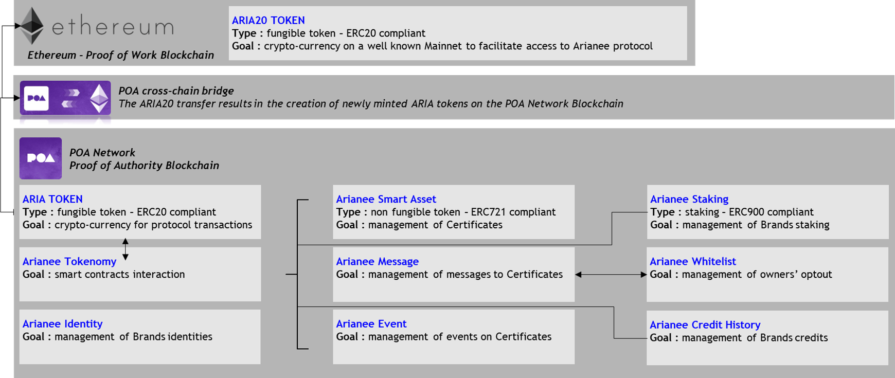
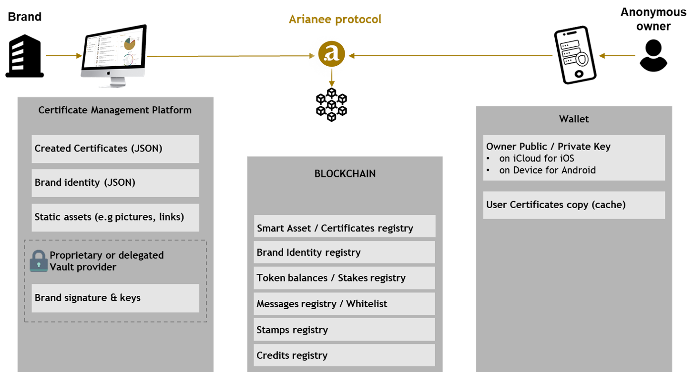
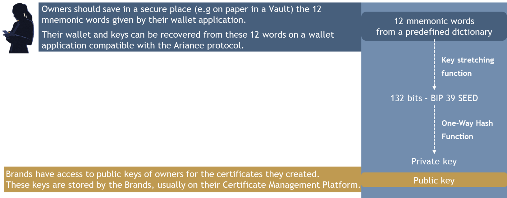

## **What is a decentralized platform?**

In the Blockchain context, a decentralized platform means that there is **no centralized data storage mechanism**. The information is available to all the participants in the network. 

From a system design perspective, there are **nodes instead of a client server**.

## **About the POA Network blockchain**

**Interoperability** is a major advantage for a Blockchain standard and the Arianee protocol aims to be as **flexible** as possible when it comes to a company selecting the underlying Blockchain it wishes to use.

 

For the first deployment of the Arianee protocol, the Arianee project selected the POA Network Blockchain for the following reasons:

*   POA Network is a **sidechain of the Ethereum blockchain** which has the second-biggest market capitalization in the Blockchain world. That means POA Network provides interoperability and facilitates asset transfers between Ethereum-based networks.
*   POA Network is **based on the Ethereum protocol** and, as we write these lines, the most mature and spread blockchain protocol to manage smart contracts. To learn more about smart contracts please refer to the dedicated section (just below).
*   **The price of transactions is cheaper** and more stable on POA Network than the Ethereum main blockchain. This is essentially due to the difference of consensus mechanism between POA Network (Proof of Autonomy) and the Ethereum mainnet (Proof of Work).
*   **The time to validate transactions is lower** on POA Network (around 5 seconds) than the Ethereum mainnet (around 15 seconds).

## **What is a smart contract?**

Smart contracts were first proposed in 1994 by Nick Szabo. He defined them as computerized transaction protocols that execute terms of a contract.

 

In practical words, a Blockchain smart contract is a **collection of code (its functions) and data (its state)** that resides at a specific address on the Blockchain. Smart contracts are **self-executing and render transactions traceable and irreversible**.

## **The Arianee smart contracts**

The Arianee protocol defines a set of smart contracts to manage tokens related to certificates. Certificates themselves are one type of smart contract, called Arianee Smart Asset.

 

Here is an overview of the Arianee protocol smart contracts:

To favor interoperability and adoption the Arianee protocol designed a crypto currency (the ARIA token) compliant with the[ ERC-20 Token Standard](https://github.com/ethereum/EIPs/blob/master/EIPS/eip-20.md) and certificates (the Arianee Smart Assets) compliant with the[ ERC-721 Token Standard](https://github.com/ethereum/eips/issues/721). To learn more about the ARIA token please refer to the [Arianee Economy](ArianeeJS) chapter.

## **About data storage**

The Arianee protocol when used at its core **never** asks, stores or uses personal information about owners. Ownership is attached to a wallet public key. **Owners are anonymous when using the Arianee protocol**.

Information and content of certificates remain available to stakeholders with the right level of permission if:

*   The stakeholder has **access to the Blockchain**.
*   The stakeholder can provide either the **secret keys** provided by the Owner or the Arianee tag on the product to unlock access to the information and content of the related certificate.
*   The links within the certificates still point to **active content**.

## **About data recovery**

Data from the Arianee protocol stored on a specific address on a Blockchain can be:

*   Read and/or enriched if and only if a set of cryptographic keys, including the public key but excluding the private key of this address, is provided.
*   Transferred if and only if the private key of this address is used in a signed transaction. There is no recovery if the private key cannot be used for signing.

 

Data stored by the Certificate Management Platform provider can be updated and recovered according to the Certificate Management Platform provider policy. **Brands should be especially cautious when selecting their Certificate Management Platform provider** because:

*   Updates of the data provided by the Certificate Management Platform provider may lead to an authentication failure of certificates.
*   If the links within the Blockchain Certificates do not point to active content anymore, owners will not have access to this content.
*   Vault breach may lead to the hack of a Brand private keys, leading to the misuse of features available to the Brand.

     

Data stored by the Wallet provider can be recovered according to the Wallet provider policy. **Owners should be especially cautious when selecting their Wallet provider** because:

*   Recovery of the owner’s wallet depends on the Wallet provider ability to safely save the owner’s private keys or to give him/her a way, such as mnemonic words, to recover their private keys in case of the loss of the wallet.
*   Wallet breach may lead to the hack of the owner private keys, leading to the misuse of his/her certificates.

## **About certificate authenticity**

The Arianee protocol provides the tools to verify the authenticity of a certificate based on three criteria:

 

*   The **Brand identity is verified**. That means the Brand went through a [Know your business (KYB) process](KYBprocess) and was registered by the Arianee project as a verified Brand ont the Arianee Identity smart contract.

     

*   The **Brand identity is authentic**. That means the Brand identity used to issue the certificate is the same than the one verified by the Arianee project.
*   The **certificate is authentic**. That means the content of the certificate has not changed since the certificate issuance.

The Arianee protocol uses the certification process designed by [0xCert](https://0xcert.org/). 
