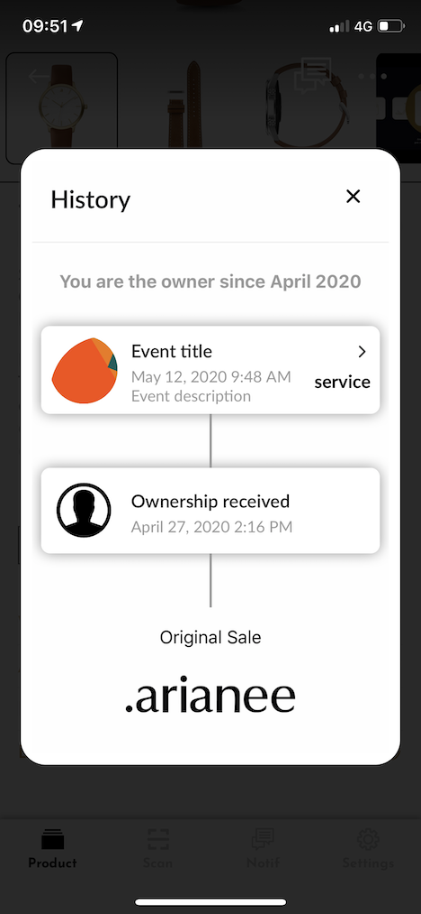

## Json Schema

JSON Schema describes Arianee Event structure content : https://cert.arianee.org/version1/ArianeeEvent-i18n.json


## Certificate example
A certificate example including all supported features


#### To view the certificate using Arianee Wallet  
[https://arian.ee/42973,lm742oxett10](https://arian.ee/42973,lm742oxett10)

or scan this QR Code


Then, click on "history" tab


#### Event render in Arianee Wallet



## Event structure walkthrough

You can read the whole JSON related to this event.
https://cert.arianee.org/cert/sampleEventAdv.json

We will walkthrough all the json schema fields

### $Schema : URL to related json schema
<!--DOCUSAURUS_CODE_TABS-->
<!--JSON SNIPPET-->
```
{
    "$schema": "https://cert.arianee.org/version1/ArianeeEvent-i18n.json",
...
```

<!--JSON SCHEMA-->
```
{
  "$id": "https://cert.arianee.org/version1/ArianeeEvent-i18n.json",
  "$schema": "https://cert.arianee.org/version1/ArianeeEvent-i18n.json",
  "title": "Arianee Event",
  "description": "Describing an Arianee Event such as servicing, auction, special event ...",
  "type": "object",
  "properties": {
    "$schema": {
      "title": "$schema",
      "type": "string",
      "default": "https://cert.arianee.org/version1/ArianeeEvent-i18n.json"
    },
...  
```
<!--END_DOCUSAURUS_CODE_TABS-->
<br/>
<br/>


### eventType : Event type
The type of Event.

<!--DOCUSAURUS_CODE_TABS-->
<!--JSON SNIPPET-->
```
...
    "eventType": "service",
...
```

<!--JSON SCHEMA-->
```
...
    "eventType": {
      "type": "string",
      "title": "Type",
      "description": "The type of Event.",
      "widget": {
              "id": "select"
            },
      "oneOf": [
        {
          "title": "Service",
          "description": "Service - usually issued by customer support.",
          "enum": [
            "service"
          ]
        },
        {
          "title": "Auction",
          "description": "Auction - usually issued when a financial transaction and a transfer of certificate are involved.",
          "enum": [
            "auction"
          ]
        }

      ]
    },
...  
```
<!--END_DOCUSAURUS_CODE_TABS-->

<br/>
<br/>


### language : Event main language
Event language

<!--DOCUSAURUS_CODE_TABS-->
<!--JSON SNIPPET-->
```
...
    "language": "en-US",
...
```

<!--JSON SCHEMA-->
```
...    
    "language": {
      "type": "string",
      "title": "Default Language",
      "widget": {
        "id": "select"
      },
      "oneOf": [
        {"enum": ["fr-FR"], "title": "French", "description": "French"},
        {"enum": ["en-US"], "title": "English (US)", "description": "English (US)"},
        {"enum": ["zh-TW"], "title": "Chinese (traditional)","description": "Chinese (traditional)"},
        {"enum": ["zh-CN"], "title": "Chinese (simplified)","description": "Chinese (simplified)"},
        {"enum": ["ko-KR"], "title":"Korean", "description": "Korean"},
        {"enum": ["ja-JP"], "title":"Japanese", "description": "Japanese"},
        {"enum": ["de-DE"], "title":"German", "description": "German"}
      ]
    },
...  
```
<!--END_DOCUSAURUS_CODE_TABS-->

> Currently, this field is not displayed on Arianee Wallet App. 


<br/>
<br/>


### title : Event title
Event title.
Likely to be the first thing displayed on a wallet app.
<!--DOCUSAURUS_CODE_TABS-->
<!--JSON SNIPPET-->
```
...
    "title": "Event title",
...
```

<!--JSON SCHEMA-->
```
...
    "title": {
      "type": "string",
      "title": "Title",
      "description": "Event title. \n Likely to be the first thing displayed on a wallet app.",
      "default": ""
    },
...  
```
<!--END_DOCUSAURUS_CODE_TABS-->


<br/>
<br/>


### description : Event description
Description of the Event. HTML is allowed.

A description can be stored for each language

<!--DOCUSAURUS_CODE_TABS-->
<!--JSON SNIPPET-->
```
...
    "description": "Event description",
...
```

<!--JSON SCHEMA-->
```
...
    "description": {
      "type": "string",
      "title": "Description",
      "description": "Description of the Event. \n A description can be stored for each language"
    },
...  
```
<!--END_DOCUSAURUS_CODE_TABS-->

<br/>
<br/>


### externalContents : Event external contents
This field is designed to store the links to external contents inside an event.
Specific external contents can be stored for each language.

Array of typed link with an order field.

Type can be website, or other type

<!--DOCUSAURUS_CODE_TABS-->
<!--JSON SNIPPET-->
```
...
    "externalContents": [{
        "title": "Arianee Website",
        "type": "website",
        "url": "https://arianee.org"
    }],
...
```

<!--JSON SCHEMA-->
```
...
    "externalContents": {
      "required": false,
      "type": "array",
      "title": "External Contents",
      "description": "This field is designed to store the links to external contents the Event issuer whish to introduce to the end customer in a wallet app.\n Specific external contents can be stored for each language.",
      "items": {
        "type": "object",
        "properties": {
          "type": {
            "type": "string",
            "title": "Type",
            "widget": {
              "id": "select"
            },
            "oneOf": [
              {"enum": ["website"], "title":"Website (main)", "description": "Website (main)"},
              {"enum": ["eshop"], "title":"Eshop", "description": "Eshop"},
              {"enum": ["other"], "title":"other", "description": "other"}
            ]
          },
          "title": {
            "type": "string",
            "title": "Title",
            "widget": {
              "id": "string"
            }
          },
          "url": {
            "type": "string",
            "title": "Url",
            "widget": {
              "id": "string"
            }
          },
          "order": {
            "type": "number",
            "title": "Order (number)"
          }
        }
      }
    },
...  
```
<!--END_DOCUSAURUS_CODE_TABS-->

<br/>
<br/>


### i18n : Event international contents
This field is designed to store international content.

Specific contents can be stored for each language.

Array of international contents.

Object is : language, description, subdescription, externalContents. Please refer to related fields

<!--DOCUSAURUS_CODE_TABS-->
<!--JSON SNIPPET-->
```
...
    "i18n":[{
        "language": "fr-FR",
        "title": "Titre d'évènement",
        "description": "Contenu d'évènement",
        "externalContents": [{
            "title": "Site web Arianee",
            "type": "website",
            "url": "https://arianee.org"
        }]
    }],
...
```

<!--JSON SCHEMA-->
```
...
     "i18n": {
      "type": "array",
      "title": "Other languages : Title / Description / External contents",
      "description": "Events' details in languages different than the default one.",
      "items": {
        "type": "object",
        "properties": {
          "language": {
            "type": "string",
            "title": "Language",
            "widget": {
              "id": "select"
            },
            "oneOf": [
              {"enum": ["fr-FR"], "title":"French", "description": "French"},
              {"enum": ["en-US"], "title":"English (US)", "description": "English (US)"},
              {"enum": ["zh-TW"], "title":"Chinese (traditional)", "description": "Chinese (traditional)"},
              {"enum": ["zh-CN"], "title":"Chinese (simplified)", "description": "Chinese (simplified)"},
              {"enum": ["ko-KR"], "title":"Korean", "description": "Korean"},
              {"enum": ["ja-JP"], "title":"Japanese", "description": "Japanese"},
              {"enum": ["de-DE"], "title":"German", "description": "German"}
            ]
          },
          "title": {
            "type": "string",
            "title": "Title",
            "widget": {
              "id": "textarea"
            }
          },
          "description": {
            "type": "string",
            "title": "Description",
            "description": "Description of the Event. \n A description can be stored for each language",
            "widget": {
              "id": "textarea"
            }
          },

          "externalContents": {
            "required": false,
            "type": "array",
            "title": "External Contents",
            "description": "This field is designed to store the links to external contents the Event issuer whish to introduce to the end customer in a wallet app.\n Specific external contents can be stored for each language.",
            "items": {
              "type": "object",
              "properties": {
                "type": {
                  "type": "string",
                  "title": "Type",
                  "widget": {
                    "id": "select"
                  },
                  "oneOf": [
                    {"enum": ["website"], "title":"Website (main)", "description": "Website (main)"},
                    {"enum": ["eshop"], "title":"Eshop", "description": "Eshop"},
                    {"enum": ["other"], "title":"other", "description": "other"}
                  ]
                },
                "title": {
                  "type": "string",
                  "title": "Title",
                  "widget": {
                    "id": "string"
                  }
                },
                "url": {
                  "type": "string",
                  "title": "Url",
                  "widget": {
                    "id": "string"
                  }
                },
                "order": {
                  "type": "number",
                  "title": "Order (number)"
                }
              }
            }
          }
        }
      }
    },
...  
```
<!--END_DOCUSAURUS_CODE_TABS-->

> International contents are displayed based on device main language. If device main language is not defined in certificate, it tries to fallback to the closest language. If not, it fallbacks to the main certificate language.


<br/>
<br/>


### medias : event medias

Picture & media used to support the presentation of the event in the wallet app.  (ideally .png with transparent background and square, less than 1mo)

Array of medias

A media is an object :
mediaType : picture, youtube
type : product (event media)
url : media url
order : media order


<!--DOCUSAURUS_CODE_TABS-->
<!--JSON SNIPPET-->
```
...
    "medias": [{
        "mediaType": "picture",
        "type": "product",
        "url": "https://theseus.arianee.org/assets/img/arianee@2x.png"
    }],
...
```

<!--JSON SCHEMA-->
```
...  
    "medias": {
      "type": "array",
      "title": "Pictures & Medias",
      "description": "Pictures & Medias used to support the presentation of the Event in the wallet app.",
      "items": {
        "type": "object",
        "properties": {
          "mediaType": {
            "type": "string",
            "title": "Media Type",
            "widget": {
              "id": "select"
            },
            "oneOf": [
              {
                "enum": [
                  "picture"
                ],
                "title": "Picture (png / jpg)",
                "description": "Picture (png / jpg)"
              },
              {
                "enum": [
                  "youtube"
                ],
                "title": "Youtube video",
                "description": "Youtube video"
              }
            ]
          },
          "type": {
            "type": "string",
            "title": "Type",
            "widget": {
              "id": "select"
            },
            "oneOf": [
              {
                "enum": [
                  "product"
                ],
                "title": "Event media / picture",
                "description": "Event media / picture"
              }
            ]
          },
          "url": {
            "type": "string",
            "title": "URL",
            "widget": {
              "id": "string"
            }
          },
          "hash": {
            "type": "string",
            "title": "Media Hash",
            "widget": {
              "id": "string"
            }
          },
          "order": {
            "type": "number",
            "title": "Media Order (number)"
          }
        }
      }
    },
...  
```
<!--END_DOCUSAURUS_CODE_TABS-->

<br/>
<br/>


### attributes : event attributes

Information on the specific attributes of the Event.

Array of attributes

An attribute is an object :
type : attribute type
value : attribute value


<!--DOCUSAURUS_CODE_TABS-->
<!--JSON SNIPPET-->
```
...
    "attributes": [{
        "type": "color",
        "value": "green"
    }],
...
```

<!--JSON SCHEMA-->
```
...  
    "attributes": {
      "type": "array",
      "title": "Specific Attributes",
      "description":"Information on the specific attributes of the Event.",
      "items": {
        "type": "object",
        "properties": {
          "type": {
            "type": "string",
            "title": "Type",
            "widget": {
              "id": "select"
            },
            "oneOf": [
              {
                "title": "Color",
                "description": "Color",
                "enum": [
                  "color"
                ]
              },
              {
                "title": "Material",
                "description": "Material",
                "enum": [
                  "material"
                ]
              },
              {
                "title": "Printed",
                "description": "Printed",
                "enum": [
                  "printed"
                ]
              }
            ]
          },
          "value": {
            "type": "string",
            "title": "Value",
            "widget": {
              "id": "string"
            }
          }
        }
      }
    },
...  
```
<!--END_DOCUSAURUS_CODE_TABS-->

> Currently, this field is not displayed on Arianee Wallet App.

<br/>
<br/>


### valuePrice : Event name
Price of the service related to the event, if applicable.

<!--DOCUSAURUS_CODE_TABS-->
<!--JSON SNIPPET-->
```
...
    "valuePrice": "1000",
...
```

<!--JSON SCHEMA-->
```
...
    "valuePrice": {
      "type": "string",
      "title": "Price",
      "default": "",
      "description": "Price of the service related to the event, if applicable."
    },
...  
```
<!--END_DOCUSAURUS_CODE_TABS-->

> Currently, this field is not displayed on Arianee Wallet App.


<br/>
<br/>


### currencyPrice : Price currency name
Related currency.

<!--DOCUSAURUS_CODE_TABS-->
<!--JSON SNIPPET-->
```
...
    "currencyPrice": "EUR"    
...
```

<!--JSON SCHEMA-->
```
...
    "currencyPrice": {
      "type": "string",
      "title": "Currency",
      "default": "",
      "description": "Currency",
      "widget": {
        "id": "select"
      },
      "oneOf": [
        {
          "title": "US Dollar",
          "description": "US Dollar",
          "enum": [
            "USD"
          ]
        },
        {
          "title": "Euro",
          "description": "Euro",
          "enum": [
            "EUR"
          ]
        },
        {
          "title": "Pound",
          "description": "Pound",
          "enum": [
            "GBP"
          ]
        }
      ]
    },
...  
```
<!--END_DOCUSAURUS_CODE_TABS-->

> Currently, this field is not displayed on Arianee Wallet App.


<br/>
<br/>


### location : Event location
Location related to the event, if applicable.

<!--DOCUSAURUS_CODE_TABS-->
<!--JSON SNIPPET-->
```
...
    "location": "Paris",
...
```

<!--JSON SCHEMA-->
```
...
    "location": {
      "type": "string",
      "title": "Location",
      "description": "Location related to the event, if applicable.",
      "default": ""
    }
...  
```
<!--END_DOCUSAURUS_CODE_TABS-->

> Currently, this field is not displayed on Arianee Wallet App.


<br/>
<br/>

