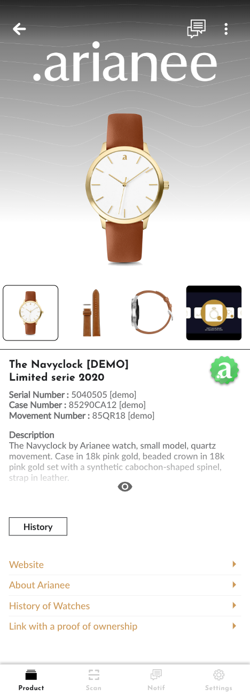

## Json Schema

JSON Schema describes Arianee Certificate structure content : https://cert.arianee.org/version1/ArianeeProductCertificate-i18n.json


## Certificate example
A certificate example including all supported features


#### To view the certificate using Arianee Wallet  
[https://arian.ee/42973,lm742oxett10](https://arian.ee/42973,lm742oxett10)

or scan this QR Code


#### Certificate render in Arianee Wallet



## Certificate structure walkthrough

You can read the whole JSON related to this certificate.
https://cert.arianee.org/cert/sampleCertAdv.json

We will walkthrough all the json schema fields

### $Schema : URL to related json schema
<!--DOCUSAURUS_CODE_TABS-->
<!--JSON SNIPPET-->
```
{
    "$schema": "https://cert.arianee.org/version1/ArianeeProductCertificate-i18n.json",
...
```

<!--JSON SCHEMA-->
```
{
  "$id": "https://cert.arianee.org/version1/ArianeeProductCertificate-i18n.json",
  "$schema": "https://cert.arianee.org/version1/ArianeeProductCertificate-i18n.json",
  "title": "Arianee Certificate",
  "type": "object",
  "properties": {
    "$schema": {
      "title": "$schema",
      "type": "string",
      "default": "https://cert.arianee.org/version1/ArianeeProductCertificate-i18n.json",
      "description": "Arianee Certificate i18n"
    },
...  
```
<!--END_DOCUSAURUS_CODE_TABS-->
<br/>
<br/>


### name : Product name
Name of the product.
Likely to be the first thing displayed on a wallet app.
<!--DOCUSAURUS_CODE_TABS-->
<!--JSON SNIPPET-->
```
...
    "name": "The Navyclock [DEMO]",
...
```

<!--JSON SCHEMA-->
```
...
    "name": {
      "type": "string",
      "title": "Name",
      "default": "",
      "description": "Name of the product.\n Likely to be the first thing displayed on a wallet app."
    },
...  
```
<!--END_DOCUSAURUS_CODE_TABS-->

<br/>
<br/>

### sku : Product sku
The stock keeping unit (SKU) is an alphanumeric code assigned to a product by a business to identify the price, product options and manufacturer of the merchandise
<!--DOCUSAURUS_CODE_TABS-->
<!--JSON SNIPPET-->
```
...
    "sku": "NAC-BB-LS20-06",
...
```

<!--JSON SCHEMA-->
```
...
    "sku": {
      "type": "string",
      "title": "SKU",
      "default": "",
      "description": "The stock keeping unit (SKU) is an alphanumeric code assigned to a product by a business to identify the price, product options and manufacturer of the merchandise."
    },
...  
```
<!--END_DOCUSAURUS_CODE_TABS-->

> Currently, this field is not displayed on Arianee Wallet App 

<br/>
<br/>

### gtin : Product GTIN
The Global Trade Item Number (GTIN) is a globally unique 14-digit number used to identify trade items, products, or services. GTIN is also an umbrella term that refers to the entire family of UCC. EAN data structures. The entire family of data structures within the GTIN is: GTIN-12 (UPC).
<!--DOCUSAURUS_CODE_TABS-->
<!--JSON SNIPPET-->
```
...
    "gtin": "0 00 12345 60001 2",
...
```

<!--JSON SCHEMA-->
```
...
    "gtin": {
      "type": "string",
      "title": "GTIN",
      "default": "",
      "description": "The Global Trade Item Number (GTIN) is a globally unique 14-digit number used to identify trade items, products, or services. GTIN is also an umbrella term that refers to the entire family of UCC. EAN data structures. The entire family of data structures within the GTIN is: GTIN-12 (UPC)."
    },
...  
```
<!--END_DOCUSAURUS_CODE_TABS-->

> Currently, this field is not displayed on Arianee Wallet App 

<br/>
<br/>


### brandInternalId : Product brandInternalId
The Global Trade Item Number (GTIN) is a globally unique 14-digit number used to identify trade items, products, or services. GTIN is also an umbrella term that refers to the entire family of UCC. EAN data structures. The entire family of data structures within the GTIN is: GTIN-12 (UPC).
<!--DOCUSAURUS_CODE_TABS-->
<!--JSON SNIPPET-->
```
...
    "brandInternalId": "NYC12345",
...
```

<!--JSON SCHEMA-->
```
...
    "brandInternalId": {
      "type": "string",
      "title": "Brand Internal ID",
      "default": "",
      "description": "Identification number that end customers will not have access to."
    },
...  
```
<!--END_DOCUSAURUS_CODE_TABS-->

> Currently, this field is not displayed on Arianee Wallet App 

<br/>
<br/>

### category : Product category
Information on the broad category the product belongs to.
<!--DOCUSAURUS_CODE_TABS-->
<!--JSON SNIPPET-->
```
...
    "category": "accessory",
...
```

<!--JSON SCHEMA-->
```
...
    "category": {
      "type": "string",
      "title": "Category",
      "description":"Information on the broad category the product belongs to.",
      "oneOf": [
        {
          "description": "Apparel",
          "title": "Apparel",
          "enum": [
            "apparel"
          ]
        },
        {
          "description": "Accessory",
          "title": "Accessory",
          "enum": [
            "accessory"
          ]
        }
      ]
    },
...  
```
<!--END_DOCUSAURUS_CODE_TABS-->

> Currently, this field is not displayed on Arianee Wallet App 

<br/>
<br/>


### intended : Product intended
Information on the target customer market of the product.
<!--DOCUSAURUS_CODE_TABS-->
<!--JSON SNIPPET-->
```
...
    "intended": "womens",
...
```

<!--JSON SCHEMA-->
```
...
    
    "intended": {
      "type": "string",
      "title": "Intended",
      "description":"Information on the target customer market of the product.",
      "temp": "Women's Men's Youth-Girls Youth-Boys Toddler-Girls Todder-Boys Infant-Girls Infant-Boys Adult Gender Neutral/Non-binary",
      "oneOf": [
        {
          "description": "Women's",
          "title": "Women's",
          "enum": [
            "womens"
          ]
        },
        {
          "description": "Men's",
          "title": "Men's",
          "enum": [
            "mens"
          ]
        },
        {
          "description": "Adult Gender Neutral",
          "title": "Adult Gender Neutral",
          "enum": [
            "neutral"
          ]
        }
      ]
    },
...  
```
<!--END_DOCUSAURUS_CODE_TABS-->

> Currently, this field is not displayed on Arianee Wallet App 

<br/>
<br/>


### serialnumber : Product serialnumber
Identification numbers that end customers will have access to.
Array of typed serial numbers

<!--DOCUSAURUS_CODE_TABS-->
<!--JSON SNIPPET-->
```
...
"serialnumber": [{
        "type": "serialnumber",
        "value": "5040505 [demo]"
    }, {
        "type": "casenumber",
        "value": "85290CA12 [demo]"
    }, {
        "type": "movementnumber",
        "value": "85QR18 [demo]"
    }],
...
```

<!--JSON SCHEMA-->
```
...
    
    "serialnumber": {
      "type": "array",
      "title": "Serial Number",
      "description": "Identification numbers that end customers will have access to.",
      "items": {
        "type": "object",
        "properties": {
          "type": {
            "type": "string",
            "title": "Type",
            "oneOf": [
              {
                "description": "Serial Number",
                "title": "Serial Number",
                "enum": [
                  "serialnumber"
                ]
              },
              {
                "description": "Case Number",
                "title": "Case Number",
                "enum": [
                  "casenumber"
                ]
              },
              {
                "description": "Movement Number",
                "title": "Movement Number",
                "enum": [
                  "movementnumber"
                ]
              },
              {
                "description": "Vehicle Identification Number",
                "title": "Vehicle Identification Number",
                "enum": [
                  "vin"
                ]
              }
            ]
          },
          "value": {
            "type": "string",
            "title": "Value"
          }
        }
      }
    },
...  
```
<!--END_DOCUSAURUS_CODE_TABS-->

<br/>
<br/>


### subBrand : Product subBrand
This field may be used when a product is part of a sub Brand owned by the Brand who creates the certificate.

<!--DOCUSAURUS_CODE_TABS-->
<!--JSON SNIPPET-->
```
...
    "subBrand": "Arianee watches",
...
```

<!--JSON SCHEMA-->
```
...
    
    "subBrand": {
      "type": "string",
      "title": "Sub Brand",
      "description": "This field may be used when a product is part of a sub Brand owned by the Brand who creates the certificate."
    },
...  
```
<!--END_DOCUSAURUS_CODE_TABS-->

> Currently, this field is not displayed on Arianee Wallet App


<br/>
<br/>


### model : Product model
Model of the product to bring precisions to the Name.
Likely to be the second thing displayed on a wallet app.
<!--DOCUSAURUS_CODE_TABS-->
<!--JSON SNIPPET-->
```
...
    "model": "Limited serie 2020",
...
```

<!--JSON SCHEMA-->
```
...
    
    "model": {
      "type": "string",
      "title": "Model",
      "description": "Model of the product to bring precisions to the Name.\n Likely to be the second thing displayed on a wallet app."
    },
...  
```
<!--END_DOCUSAURUS_CODE_TABS-->

<br/>
<br/>


### language : Certificate main language
Main certificate language

<!--DOCUSAURUS_CODE_TABS-->
<!--JSON SNIPPET-->
```
...
    "language": "en-US",
...
```

<!--JSON SCHEMA-->
```
...
    
"language": {
      "type": "string",
      "title": "Language",
      "description": "Descriptions and external contents can be stored in different languages",
      "oneOf": [
        {
          "title": "French",
          "description": "French",
          "enum": [
            "fr-FR"
          ]
        },
        {
          "title": "English (US)",
          "description": "English (US)",
          "enum": [
            "en-US"
          ]
        },
        {
          "title": "Chinese (traditional)",
          "description": "Chinese (traditional)",
          "enum": [
            "zh-TW"
          ]
        },
        {
          "title": "Chinese (simplified)",
          "description": "Chinese (simplified)",
          "enum": [
            "zh-CN"
          ]
        },
        {"enum": ["ko-KR"], "title":"Korean", "description": "Korean"},
        {"enum": ["ja-JP"], "title":"Japanese", "description": "Japanese"},
        {"enum": ["de_DE"], "title":"German", "description": "German"}
      ]
    },
...  
```
<!--END_DOCUSAURUS_CODE_TABS-->

> Currently, this field is not displayed on Arianee Wallet App. 


<br/>
<br/>


### description : Certificate description
Certificate description. HTML is allowed

<!--DOCUSAURUS_CODE_TABS-->
<!--JSON SNIPPET-->
```
...
    "description": "<b>Description</b>\nThe Navyclock by Arianee watch, small model, quartz movement. Case in 18k pink gold, beaded crown in 18k pink gold set with a synthetic cabochon-shaped spinel, strap in leather. \n\n<b>Case dimensions</b>\ndiameter: 29.5 mm, thickness: 6.35 mm, water-resistant to 3 bar (approx. 30 meters/100 feet).",
...
```

<!--JSON SCHEMA-->
```
...
    "description": {
      "type": "string",
      "title": "Description",
      "description": "Description of the product. (HTML Accepted)\n A description can be stored for each language"
    },
...  
```
<!--END_DOCUSAURUS_CODE_TABS-->

<br/>
<br/>


### subDescription : Certificate sub description
Certificate sub description. HTML is allowed.
Array of typed subdescription

<!--DOCUSAURUS_CODE_TABS-->
<!--JSON SNIPPET-->
```
...
    "subDescription": [{
        "type": "other",
        "title": "The Navyclock watchmaking process",
        "content": "The Navyclock preserves the perfectly pitched classical elegance and signature Arianee features. The brand has been producing its own in-house movements since 2017. The movements boast a host of features but are designed to be thin by incorporating various complications into the mainplate.",
        "order": 1
    }, {
        "type": "service",
        "title": "Customer service information",
        "content": "The Navyclock is rarely down. When it happens you can be sure our network will be here for you. ",
        "order": 2
    }],
...
```

<!--JSON SCHEMA-->
```
...

    "subDescription": {
      "required": false,
      "type": "array",
      "title": "Description (more)",
      "items": {
        "type": "object",
        "properties": {
          "type": {
            "type": "string",
            "title": "Type",
            "oneOf": [
              {
                "enum": [
                  "service"
                ],
                "title": "Servicing",
                "description": "Servicing"
              },
              {
                "enum": [
                  "recycling"
                ],
                "title": "Recycling",
                "description": "Recycling"
              },
              {
                "enum": [
                  "other"
                ],
                "title": "other",
                "description": "other"
              }
            ]
          },
          "title": {
            "type": "string",
            "title": "Title"
          },
          "content": {
            "type": "string",
            "title": "Content"
          },
          "order": {
            "type": "number",
            "title": "Order (number)"
          }
        }
      }
    },
...  
```
<!--END_DOCUSAURUS_CODE_TABS-->

> Currently, this field is not displayed on Arianee Wallet App. 

<br/>
<br/>


### externalContents : Certificate external contents
This field is designed to store the links to external contents the Brand whish to introduce to the end customer in a wallet app.
Specific external contents can be stored for each language.

Array of typed link with an order field.

Type can be website, proofLinkAction [Check action proof link method](arianee-js-certificate#create-an-action-proof-link)

<!--DOCUSAURUS_CODE_TABS-->
<!--JSON SNIPPET-->
```
...
    "externalContents": [{
        "type": "website",
        "title": "Website",
        "url": "https://www.arianee.org/",
        "order": 1
    }, {
        "type": "website",
        "title": "About Arianee",
        "url": "https://www.arianee.org/about-arianee",
        "order": 3
    }, {
        "type": "website",
        "title": "History of Watches",
        "url": "https://en.wikipedia.org/wiki/History_of_watches",
        "order": 2
    }, {
        "type": "proofLinkAction",
        "title": "Link with a proof of ownership",
        "url": "https://test.arian.ee/proofLinkAction.html"
    }],
...
```

<!--JSON SCHEMA-->
```
...
    "externalContents": {
      "description": "This field is designed to store the links to external contents the Brand whish to introduce to the end customer in a wallet app.\n Specific external contents can be stored for each language.",
      "required": false,
      "type": "array",
      "title": "External Contents",
      "items": {
        "type": "object",
        "properties": {
          "type": {
            "type": "string",
            "title": "Type",
            "oneOf": [
              {
                "enum": [
                  "website"
                ],
                "title": "Website (main)",
                "description":"Regular link"
              },
              {
                "enum": [
                  "proofLinkAction"
                ],
                "title": "proofLinkAction",
                "description": "Link with a proof of ownership"
              },
              {
                "enum": [
                  "transparency"
                ],
                "title": "transparency",
                "description": "Url of transparency events json"
              }
            ]
          },
          "title": {
            "type": "string",
            "title": "Title"
          },
          "url": {
            "type": "string",
            "title": "Url"
          },
          "order": {
            "type": "number",
            "title": "Order (number)"
          }
        }
      }
    },
...  
```
<!--END_DOCUSAURUS_CODE_TABS-->

<br/>
<br/>


### i18n : Certificate international contents
This field is designed to store international content.

Specific contents can be stored for each language.

Array of internation contents.

Object is : language, description, subdescription, externalContents. Please refer to related fields

<!--DOCUSAURUS_CODE_TABS-->
<!--JSON SNIPPET-->
```
...
  "i18n": [{
        "language": "fr-FR",
        "description": "<b>Description</b>\nLa montre The Navyclock d'Arianee est un petit modèle utilisant le mouvement à quartz. Boitier en or rose 18 carats, Couronne perlée en or rose 18 carats sertie d'un spinelle synthétique en forme de cabochon, bracelet en cuir.\n\n<b>Dimensions</b>\ndiamètre: 29.5 mm, épaisseur: 6.35 mm, étanche à 3 bar (environ 30 mètres/100 pieds).",
        "subDescription": [],
        "externalContents": [{
            "type": "website",
            "title": "Site",
            "url": "https://www.arianee.org/",
            "order": 1
        }, {
            "type": "website",
            "title": "Arianee",
            "url": "https://www.arianee.org/about-arianee",
            "order": 3
        }, {
            "type": "website",
            "title": "L'Histoires des montres ",
            "url": "https://fr.wikipedia.org/wiki/Montre_(horlogerie)",
            "order": 2
        }, {
            "type": "proofLinkAction",
            "title": "Link with a proof of ownership",
            "url": "https://test.arian.ee/proofLinkAction.html"
        }]
    }, {
        "language": "zh-CN",
        "description": "<b>描述</b>\nThe Navyclock by Arianee 手表，小型款，石英机芯. 18k玫瑰金表壳，18k玫瑰金串珠状表冠，镶有凸圆形人造合成尖晶石，皮革表带.\n\n<b>外壳尺寸</b>\n直径：29.5毫米，厚度：6.35毫米，防水深度达3巴（约30米/ 100英尺\n",
        "subDescription": [],
        "externalContents": [{
            "type": "website",
            "title": " 网站",
            "url": "https://www.arianee.org/",
            "order": 1
        }, {
            "type": "website",
            "title": " 关于 Arianee",
            "url": "https://www.arianee.org/about-arianee",
            "order": 3
        }, {
            "type": "website",
            "title": " 手表的历史",
            "url": "https://zh.wikipedia.org/wiki/%E6%89%8B%E8%A1%A8",
            "order": 2
        }]
    }],
...
```

<!--JSON SCHEMA-->
```
...
    "i18n": {
      "type": "array",
      "title": "Other languages :  description / external contents",
      "items": {
        "type": "object",
        "properties": {
          "language": {
            "type": "string",
            "title": "Language",
            "oneOf": [
              {
                "description": "French",
                "title": "French",
                "enum": [
                  "fr-FR"
                ]
              },
              {
                "description": "English (US)",
                "title": "English (US)",
                "enum": [
                  "en-US"
                ]
              },
              {
                "description": "Chinese (traditional)",
                "title": "Chinese (traditional)",
                "enum": [
                  "zh-TW"
                ]
              },
              {
                "description": "Chinese (simplified)",
                "title": "Chinese (simplified)",
                "enum": [
                  "zh-CN"
                ]
              },
              {"enum": ["ko-KR"], "title":"Korean", "description": "Korean"},
              {"enum": ["ja-JP"], "title":"Japanese", "description": "Japanese"},
              {"enum": ["de_DE"], "title":"German", "description": "German"}
            ]
          },
          "description": {
            "type": "string",
            "title": "Description"
          },
          "subDescription": {
            "required": false,
            "type": "array",
            "title": "Description (more)",
            "items": {
              "type": "object",
              "properties": {
                "type": {
                  "type": "string",
                  "title": "Type",
                  "oneOf": [
                    {
                      "enum": [
                        "service"
                      ],
                      "title": "Servicing",
                      "description": "Additional descriptions linked to the product. \nSub descriptions can be stored for each language"
                    },
                    {
                      "enum": [
                        "recycling"
                      ],
                      "title": "Recycling",
                      "description": "Recycling"
                    },
                    {
                      "enum": [
                        "other"
                      ],
                      "title": "other",
                      "description": "Additional descriptions linked to the product. \nSub descriptions can be stored for each language"
                    }
                  ]
                },
                "title": {
                  "type": "string",
                  "title": "Title"
                },
                "content": {
                  "type": "string",
                  "title": "Content"
                },
                "order": {
                  "type": "number",
                  "title": "Order (number)"
                }
              }
            }
          },
          "externalContents": {
            "required": false,
            "type": "array",
            "title": "External Contents",
            "items": {
              "type": "object",
              "properties": {
                "type": {
                  "type": "string",
                  "title": "Type",
                  "oneOf": [
                    {
                      "enum": [
                        "website"
                      ],
                      "title": "Website (main)",
                      "description": "Regular link"
                    },
                    {
                      "enum": [
                        "proofLinkAction"
                      ],
                      "title": "proofLinkAction",
                      "description": "Link with a proof of ownership"
                    },
                    {
                      "enum": [
                        "transparency"
                      ],
                      "title": "transparency",
                      "description": "Url of transparency events json"
                    }
                  ]
                },
                "title": {
                  "type": "string",
                  "title": "Title"
                },
                "url": {
                  "type": "string",
                  "title": "Url"
                },
                "order": {
                  "type": "number",
                  "title": "Order (number)"
                }
              }
            }
          }
        }
      }
    },
...  
```
<!--END_DOCUSAURUS_CODE_TABS-->

> International contents are displayed based on device main language. If device main language is not defined in certificate, it tries to fallback to the closest language. If not, it fallbacks to the main certificate language.


<br/>
<br/>


### msrp : manufacturer's suggested retail price
The manufacturer's suggested retail price (MSRP) is the price a product's producer recommends it be sold for in retail stores. MSRP Country should respect ISO 3166 alpha-3
<!--DOCUSAURUS_CODE_TABS-->
<!--JSON SNIPPET-->
```
...
 "msrp": [{
        "msrp": "35000",
        "currency": "EUR",
        "msrpCountry": "Europe"
    }, {
        "msrp": "32000",
        "currency": "GBP",
        "msrpCountry": "United Kingdom"
    }, {
        "msrp": "40000",
        "currency": "USD",
        "msrpCountry": "USA"
    }],
...
```

<!--JSON SCHEMA-->
```
...  
    "msrp": {
      "type": "array",
      "title": "Manufacturers suggested retail price",
      "description":"The manufacturer's suggested retail price (MSRP) is the price a product's producer recommends it be sold for in retail stores. MSRP Country should respect ISO 3166 alpha-3",
      "items": {
        "type": "object",
        "properties": {
          "msrp": {
            "type": "string",
            "title": "MSRP",
            "default": "",
            "description": "Manufacturers suggested retail price (number)"
          },
          "currency": {
            "type": "string",
            "title": "Currency",
            "default": "",
            "description": "Currency",
            "oneOf": [
              {
                "title": "US Dollar",
                "description": "US Dollar",
                "enum": [
                  "USD"
                ]
              },
              {
                "title": "Euro",
                "description": "Euro",
                "enum": [
                  "EUR"
                ]
              },
              {
                "title": "Pound",
                "description": "Pound",
                "enum": [
                  "GBP"
                ]
              }
            ]
          },
          "msrpCountry": {
            "type": "string",
            "title": "Country (msrp)",
            "default": "",
            "description": "Country of Intended Original Sale (ISO 3166 alpha-3)"
          }
        }
      }
    },
...  
```
<!--END_DOCUSAURUS_CODE_TABS-->

> Currently, this field is not displayed on Arianee Wallet App.

<br/>
<br/>


### medias : certificate medias

Picture & media used to support the presentation of the product in the wallet app.  (ideally .png with transparent background and square, less than 1mo)

Array of medias

A media is an object :
mediaType : picture, youtube
type : product (certificate media),  brandItemBackgroundPicture (media for certificate list), itemBackgroundPicture (media for certificate background), certificateBackgroundPicture (media for certificate background share-transfer)
url : media url
order : media order


<!--DOCUSAURUS_CODE_TABS-->
<!--JSON SNIPPET-->
```
...
    "medias": [{
        "mediaType": "picture",
        "type": "product",
        "url": "https://bdharianeetest.firebaseapp.com/pub/-Lzfbb6qGXMN3LVhPRWG_arianeeResized",
        "order": 1
    }, {
        "mediaType": "picture",
        "type": "product",
        "url": "https://bdharianeetest.firebaseapp.com/pub/-LzfbcJwhZPNES_2NK1h_arianeeResized",
        "order": 3
    }, {
        "mediaType": "picture",
        "type": "product",
        "url": "https://bdharianeetest.firebaseapp.com/pub/-LzfbdNMkhOxvu5n_cPv_arianeeResized",
        "order": 2
    }, {
        "mediaType": "picture",
        "type": "brandItemBackgroundPicture",
        "url": "https://bdharianeetest.firebaseapp.com/pub/-LtzQIIK-FD65qAFCBEm"
    }, {
        "mediaType": "youtube",
        "type": "product",
        "url": "https://www.youtube.com/watch?v=Z7v41l4I-Gc",
        "ytId": "Z7v41l4I-Gc",
        "thumbnail": "https://img.youtube.com/vi/Z7v41l4I-Gc/0.jpg",
        "embedURL": "https://www.youtube.com/embed/Z7v41l4I-Gc"
    }, {
        "mediaType": "picture",
        "type": "itemBackgroundPicture",
        "url": "https://bdharianeemaxime.firebaseapp.com/pub/-LzI78FCrDVaPk8tQkl9"
    }, {
        "mediaType": "picture",
        "type": "certificateBackgroundPicture",
        "url": "https://bdharianeemaxime.firebaseapp.com/pub/-LzI7CrFW31aP_hyx1ZE"
    }],
...
```

<!--JSON SCHEMA-->
```
...  
    "medias": {
      "type": "array",
      "title": "Medias",
      "description": "Picture & media used to support the presentation of the product in the wallet app.  (ideally .png with transparent background and square, less than 1mo)",
      "items": {
        "type": "object",
        "properties": {
          "mediaType": {
            "type": "string",
            "title": "Media Type",
            "oneOf": [
              {
                "enum": [
                  "picture"
                ],
                "title": "Picture (png / jpg)",
                "description": "Picture (png / jpg)"
              },
              {
                "enum": [
                  "youtube"
                ],
                "title": "Youtube video",
                "description": "Youtube video"
              }
            ]
          },
          "type": {
            "type": "string",
            "title": "Type",
            "oneOf": [
              {
                "enum": [
                  "product"
                ],
                "title": "Product media / picture",
                "description": "used to support the presentation of the product in the wallet app.  (ideally .png with transparent background and square, less than 1mo)"
              },
              {
                "enum": [
                  "brandItemBackgroundPicture"
                ],
                "title": "Brand Item Background Picture (3200x1900) ratioed",
                "description": "(3200x1900), format : jpg/png, max 400ko created for the certificate in the list of certificates someone has. It should include a product picture."
              },
              {
                "enum": [
                  "itemBackgroundPicture"
                ],
                "title": "Item Background Picture (3000x3000) ratioed",
                "description": "dark, format .jpg, (3000x3000) max 400ko created for the background of the certificate screen"
              },
              {
                "enum": [
                  "certificateBackgroundPicture"
                ],
                "title": "Certificate Background Picture (1900x3200 TBD) preferably dark - with logo on top",
                "description": "dark, no logo, format .jpg, (1900x3200), max 400ko created for the background of the transfer/proof of certificate screens"
              }
            ]
          },
          "url": {
            "type": "string",
            "title": "URL"
          },
          "hash": {
            "type": "string",
            "title": "Media Hash"
          },
          "order": {
            "type": "number",
            "title": "Media Order (number)"
          }
        }
      }
    },
...  
```
<!--END_DOCUSAURUS_CODE_TABS-->

<br/>
<br/>


### attributes : product attributes

Information on the specific attributes of the product.

Array of attributes

An attribute is an object :
type : attribute type
value : attribute value


<!--DOCUSAURUS_CODE_TABS-->
<!--JSON SNIPPET-->
```
...
    "attributes": [{
        "type": "color",
        "value": "Gold"
    }],
...
```

<!--JSON SCHEMA-->
```
...  
    "attributes": {
      "type": "array",
      "title": "Attributes",
      "description":"Information on the specific attributes of the product.",
      "items": {
        "type": "object",
        "properties": {
          "type": {
            "type": "string",
            "title": "Type",
            "oneOf": [
              {
                "title": "Color",
                "description": "Color",
                "enum": [
                  "color"
                ]
              },
              {
                "title": "Printed",
                "description": "Printed",
                "enum": [
                  "printed"
                ]
              },
              {
                "title": "Complication",
                "description": "Complication",
                "enum": [
                  "complication"
                ]
              }
            ]
          },
          "value": {
            "type": "string",
            "title": "Value"
          }
        }
      }
    },
...  
```
<!--END_DOCUSAURUS_CODE_TABS-->

> Currently, this field is not displayed on Arianee Wallet App.

<br/>
<br/>


### materials : product materials

Information on the materials used to manufacture the product.
Array of materials

A material is an object :
material : material name
value : material value
pourcentage : pourcentage value


<!--DOCUSAURUS_CODE_TABS-->
<!--JSON SNIPPET-->
```
...
    "materials": [{
        "material": "gold",
        "pourcentage": "50%"
    }],
...
```

<!--JSON SCHEMA-->
```
...  
    "materials": {
      "type": "array",
      "title": "Materials",
      "description":"Information on the materials used to manufacture the product.",
      "items": {
        "type": "object",
        "properties": {
          "material": {
            "type": "string",
            "title": "Material",
            "temp": "Cashmere / Cotton / Denim - Jeans / Exotic leathers / Faux fur / Fur /Leather / Linen / Polyester / Silk / Suede / Synthetic / Tweed / Velvet / Viscose / Wool",
            "oneOf": [
              {
                "title": "Cashmere",
                "description": "Cashmere",
                "enum": [
                  "cashmere"
                ]
              },
              {
                "title": "Cotton",
                "description": "Cotton",
                "enum": [
                  "cotton"
                ]
              },
              {
                "title": "Denim - Jeans",
                "description": "Denim - Jeans",
                "enum": [
                  "denim-jeans"
                ]
              },
              {
                "title": "Gold",
                "description": "Gold",
                "enum": [
                  "gold"
                ]
              },
              {
                "title": "Silver",
                "description": "Silver",
                "enum": [
                  "silver"
                ]
              }
            ]
          },
          "value": {
            "type": "string",
            "title": "Value"
          },
          "pourcentage": {
            "type": "string",
            "title": "Pourcentage",
            "description": "Pourcentage without % (numeric)"
          }
        }
      }
    },
...  
```
<!--END_DOCUSAURUS_CODE_TABS-->

> Currently, this field is not displayed on Arianee Wallet App.

<br/>
<br/>


### size : product size

Information on the size of the product.Array of sizes

A size is an object :
type : size type (height / width / depth / size)
value : size value
unit : size unit (inch / centimer / millimeter / EU / UK / US)


<!--DOCUSAURUS_CODE_TABS-->
<!--JSON SNIPPET-->
```
...
    "size": [{
        "type": "depth",
        "value": "6",
        "unit": "in"
    }, {
        "type": "depth",
        "value": "3,6",
        "unit": "cm"
    }],
...
```

<!--JSON SCHEMA-->
```
...  
    "size": {
      "type": "array",
      "title": "Sizes",
      "description":"Information on the size of the product.",
      "items": {
        "type": "object",
        "properties": {
          "type": {
            "type": "string",
            "title": "Type",
            "oneOf": [
              {
                "title": "Height",
                "description": "Height",
                "enum": [
                  "height"
                ]
              },
              {
                "title": "Width",
                "description": "Width",
                "enum": [
                  "width"
                ]
              },
              {
                "title": "Depth",
                "description": "Depth",
                "enum": [
                  "depth"
                ]
              },
              {
                "title": "Size",
                "description": "Size",
                "enum": [
                  "size"
                ]
              }
            ]
          },
          "value": {
            "type": "string",
            "title": "Value"
          },
          "unit": {
            "type": "string",
            "title": "Unit",
            "oneOf": [
              {
                "title": "Inch",
                "description": "Inch",
                "enum": [
                  "in"
                ]
              },
              {
                "title": "Centimer",
                "description": "Centimer",
                "enum": [
                  "cm"
                ]
              },
              {
                "title": "Millimeter",
                "description": "Millimeter",
                "enum": [
                  "mm"
                ]
              },
              {
                "title": "EU",
                "description": "EU",
                "enum": [
                  "eu"
                ]
              },
              {
                "title": "UK",
                "description": "UK",
                "enum": [
                  "uk"
                ]
              },
              {
                "title": "US",
                "description": "US",
                "enum": [
                  "us"
                ]
              }
            ]
          }
        }
      }
    },
...  
```
<!--END_DOCUSAURUS_CODE_TABS-->

> Currently, this field is not displayed on Arianee Wallet App.

<br/>
<br/>


### manufacturingCountry : product manufacturing country

Country of manufacture in final assembly stage. (ISO 3166 alpha-3)


<!--DOCUSAURUS_CODE_TABS-->
<!--JSON SNIPPET-->
```
...
    "manufacturingCountry": "Switzerland",
...
```

<!--JSON SCHEMA-->
```
...  
    "manufacturingCountry": {
      "type": "string",
      "title": "Country (manufacturing)",
      "default": "",
      "description": "Country of manufacture in final assembly stage. (ISO 3166 alpha-3)"
    },
...  
```
<!--END_DOCUSAURUS_CODE_TABS-->

> Currently, this field is not displayed on Arianee Wallet App.

<br/>
<br/>


### facilityId : product facility ID

Facility Identification in Open Apparel Registry (OAR) or GS1 database

<!--DOCUSAURUS_CODE_TABS-->
<!--JSON SNIPPET-->
```
...
    "facilityId": "12345",
...
```

<!--JSON SCHEMA-->
```
...  
   "facilityId": {
      "type": "string",
      "title": "Facility Identification number",
      "default": "",
      "description": "Facility Identification in Open Apparel Registry (OAR) or GS1 database"
    },
...  
```
<!--END_DOCUSAURUS_CODE_TABS-->

> Currently, this field is not displayed on Arianee Wallet App.

<br/>
<br/>


### productCertification : product certification

Certifications a Brand owns at the product level. 
It is currently an information not verified and the Brand bares all responsibilities related to its affiliation to a certification.

Array of certification

<!--DOCUSAURUS_CODE_TABS-->
<!--JSON SNIPPET-->
```
...
    "productCertification": [{
        "name": "fairtrade"
    }]
...
```

<!--JSON SCHEMA-->
```
...  
    "productCertification": {
      "type": "array",
      "title": "Product Certifications & Compliance",
      "description": "Certifications a Brand owns at the product level. 
      It is currently an information not verified and the Brand bares all responsibilities related to its affiliation to a certification. ",
      "items": {
        "type": "object",
        "properties": {
          "name": {
            "type": "string",
            "title": "Name",
            "oneOf": [
              {
                "title": "Fair Trade",
                "description": "Fair Trade",
                "enum": [
                  "fairtrade"
                ]
              },
              {
                "title": "WWF",
                "description": "WWF",
                "enum": [
                  "wwf"
                ]
              }
            ]
          }
        }
      }
    }
...  
```
<!--END_DOCUSAURUS_CODE_TABS-->

> Currently, this field is not displayed on Arianee Wallet App.

<br/>
<br/>


