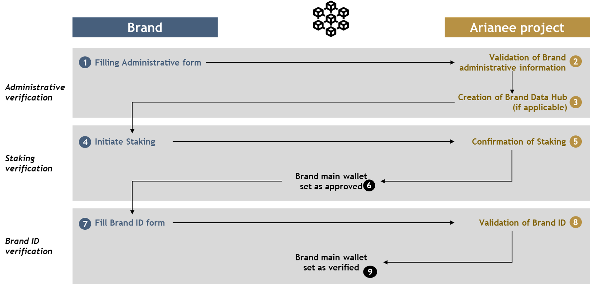

**Brands** are the source of each certificate. For their certificates to be classified as authentic when issued: 

- The **Brand identity (Brand ID) must be verified.** That means the Brand went through a *Know Your Business* (KYB) process, described in this paper.
- The **Brand identity (Brand ID) must be authentic.** That means the Brand ID used to issue the certificate is the same than the one verified.

This chapter describes the *Know Your Business* (KYB) process a Brand should follow to be verified.

## **What is the KYB Process ?**

The *Know Your Business* (KYB) process describes the different steps a Brand must follow to be verified. The three major steps are:

- Administrative verification
- Brand ID verification
- Staking verification

## **Who are the KYB stakeholders ?**

The information provided by a Brand is verified by the Onboarding team of the Arianee project.

The Brand may choose to use a Certificate Management Platform designed by Arianee SAS: a Brand Data Hub.

The Blockchain address of the Brand main wallet is approved and set as verified on the Blockchain by the Arianee Identity Multisig team from the Arianee Project & Arianee SAS.

## **KYB fees**

Initiating the KYB process and going through the whole process is free for Brands. All the administrative costs are supported by the Arianee project.

If the Brand decides to use the Brand Data Hub as its Certificate Management Platform, relating costs are to be discussed either with the Arianee project team or the Arianee SAS team.

## **Administrative verification**

The KYB process starts by the Brand filling the form below to collect the administrative information required (for more details on the information required please refer to the dedicated section).

- FR : https://forms.monday.com/forms/2e69ff966a5fc539a12134b305791cc4
- EN : https://forms.monday.com/forms/9511074102dce79ec415c35416376862 

Filling the form initiates the review of its content by the Onboarding team from the Arianee project. 

Once the information is reviewed and verified, two cases arise:

- The Brand decided to use the Brand Data Hub as its Certificate Management Platform: the Arianee SAS team builds it and provides the Blockchain address of the Brand main wallet for the next step.
- The Brand decided **not** to use the Brand Data Hub as its Certificate Management Platform: the Brand must provide the Blockchain address of its main wallet for the next step.

Last, the Blockchain address of the Brand main wallet is approved on the Blockchain by the Arianee Identity Multisig team from the Arianee Project. 

At this point the Brand ID verification starts.

**Notes:** 

- Arianee project members skip the administrative verification and start there KYB process with the Brand ID verification.
- Legal entities that wish to register a new Brand or update a registered Brand skip the administrative verification and start the KYB process with the Brand verification.
- The administrative information provided by a Brand is stored by the Arianee project. It remains internal and it is not shared outside of the Arianee project.

## **Brand ID  verification**

The second step of the KYB process starts by the Brand filling the form below to collect the Brand ID content. To learn more about the information required please refer to the Brand identity chapter (work in progress).

- FR : https://forms.monday.com/forms/c39a0b99a52551443c7a23cf51d0e816
- EN : https://forms.monday.com/forms/1c10c89c870cfea04c0d32f78b4652eb 

Filling the form initiates the review of its content by the Onboarding team from the Arianee project. 
Once the information is reviewed and verified, the staking verification starts. 

## **Staking verification**

The last step of the KYB process starts with the staking leader from the Arianee project requesting the Brand to stake by email. To learn more about the structure and amount of staking please refer to the staking policy (work in progress).

Once the stake is reviewed and verified, the Blockchain address of the Brand main wallet is set as verified on the Blockchain by the Arianee Identity Multisig team from the Arianee Project. 
**At this point the Brand is verified and can start issuing authentic certificates.**

## **About interfaces**

No specific interface is necessary for Brands to complete the KYB process, only a web browser to access the Administrative and the Brand ID forms.

## **About Arianee project members**

Arianee project members skip the administrative verification and start there KYB process with the Brand ID verification. Indeed, members already provided the administrative evidence that they are backed by a legal entity.