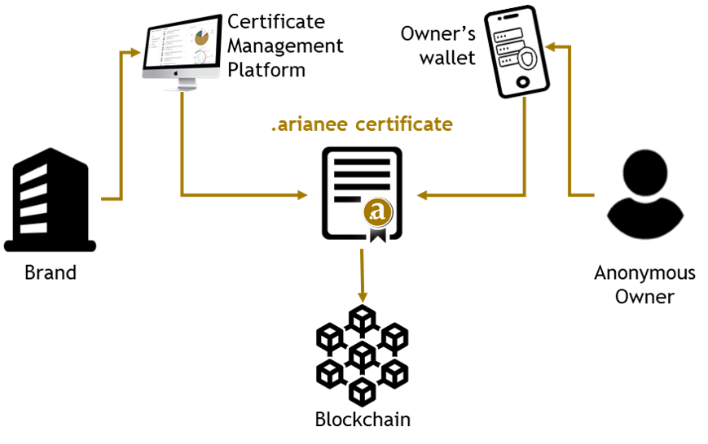

The **Arianee project** is an independent & participative association that promotes & provides guidelines and tools to set a **global standard for the digital certification of valuable products**. These guidelines and tools are bundled under the name of the **Arianee protocol**.

 

_If you are a developer, reading this documentation and going through the demo should take a couple of hours. No previous knowledge of Blockchain is required. Once you are done, you will know how to manage a certificate on a Blockchain using the Arianee protocol._

## **The Arianee project**

The Arianee project is an association **governed by its members** and founders. Members are either brands or partners, each one has a seat at the table so that the **standard is designed by industry specialists**.

 

The revenues are dedicated to the Arianee project main purpose: **promoting and developing the Arianee protocol**. There is no shareholder and no possibility for a takeover from a corporate company.

To learn more about the Arianee project governance please refer to the[ Constituent by-laws](https://drive.google.com/file/d/1BiLiBNzg6Z9bJ6QoP0naFsIq6L5sRj8Y/view?usp=sharing).

## **The Arianee protocol**

The Arianee protocol enables management of custom assets called **certificates.** Certificates are **non-fungible tokens** (NFTs) compliant with the[ Ethereum's ERC-721 standard](https://github.com/ethereum/EIPs/blob/master/EIPS/eip-721.md). They represent a unique, either digital or real-life product with its unique metadata stored as a data imprint on a **distributed ledger**.

 

The Arianee protocol is a **Blockchain based protocol**. It allows decentralized, independent and secure verification so that all users can trust each other without relying on a single centralizing third party. The distributed architecture of blockchain also ensures higher uptime and censorship-resistance.

 

The Arianee protocol is **open source with open access to data streams**. That means:

*    the code is fully transparent and auditable (_Public audits available here_).
*   you may contribute to[ The Arianee Github.](https://github.com/Arianee/ArianeeMaster)

## **What does it solve?**

The Ariane Protocol **fills the lack of a standardized process to create perpetual, secure and authentic digital certificates for valuable products**.

 

Certificates as designed by the Arianee project **drastically limit counterfeiting**. This is no small thing: according to the Global Brand Counterfeiting Report, 2018, losses incurred by Luxury Brands because of sale of counterfeiting through internet accounted to 30.3 Billion USD.

 

Certificates as designed by the Arianee protocol provide a **private and safe communication channel between brands and their customers through messages**. This is no small thing either: for legal reasons such as GRPD, product’s lifecycle reasons such as secondhand resale or because of the distribution channels used such as third-party resellers, Brands lose track of their products and cannot communicate with their customers.

 

Use cases and problems solved by certificates go far beyond these two major cases, you can discover additional examples in the use cases examples section. The possibilities are only limited to Brands & service providers’ imagination.

## **Who is it for?**

The Arianee project mission is to provide the valuable products’ ecosystem a secure environment to create and manage certificates.

The Arianee protocol mission is to equip interface developers with a framework for building applications such as Certificate Management Platforms or wallets of certificates. This enables developers to focus on the application layer and quickly deliver integrated solutions based on standardized certificates.

## **Ecosystem**

The necessary ecosystem for the Arianee protocol to run include six stakeholders:

 

*   **Brands** are the source of each certificate. For their certificates to be classified as authentic, Brands need to meet a specific set of criteria. To learn more please refer to the _Know Your Business  (KYB), process (Work in progress)_ .
*   **Owners** are end users of the certificates.
*   **The Arianee project** promotes and develops the Arianee protocol.
*   **Certificate Management Platform providers** own the module used by Brands to create and manage certificates on the Blockchain.
*   **Wallet providers** own the mobile or web application giving owners access to their certificates and data stored by the brands. The wallet application let the owner import or use a newly created Blockchain address to manage his/her certificates.
*   **Nodes** validate transactions related to the Arianee protocol on the Blockchain.

 

 

Additional stakeholders have or will have a part to play in the ecosystem:

 

*   **Third parties** such as resellers, secondhand buyers or insurers will interact with products and might want to **read or stamp certificates**.
*   **Identification technology providers** are the link between the digital or real-life product and the certificate.
*   **Investors** are trading the Aria token, the cryptocurrency used to pay for the main features of the Arianee protocol. To learn more about the Aria economy please refer to its dedicated chapter.

## **Key features**

The Arianee protocol enables an effective and multi-function library for managing certificates. Its core features include:

 

*   **Creation** of Certificates. This feature is dedicated to Brands.
*   **Transfer** of Certificates from one owner to another. Except for very specific cases, the transfer can only be initiated by the current owner.
*   **Proof of ownership** It can only be generated by the owner of a certificate.
*   **Proof of authenticity** A certificate to be authentic needs to be created by a registered Brand (to learn more please refer to the _admission process_). 
*   **Messages** Brands and third parties who interacted with a certificate can interact with it through messages.
*   **Certificate history** All dates and types of events related to a certificate are recorded and available on the Blockchain.

Premium features such as Creation of Certificates and Messages must be paid with the Aria token, the currency of the Arianee protocol. The Ordinary General Meeting (including all members of the Arianee project) has sole authority to set the price of the features related to the Arianee protocol. To learn more about the Aria economy please refer to its dedicated chapter.

To learn more about the Arianee protocol features _please refer to the ArianeeJS chapter_.

## **Use case examples**

Use cases and problems solved by certificates go far beyond the two major cases (limiting counterfeiting and messaging owners). They go far beyond the ones below as well. The possibilities are only limited to Brands & service providers’ imagination.

 

**Second hand:**

The owner quickly lists the product on a secondhand marketplace based on the detailed information embedded in the certificate, including history of the product. Transaction security is enhanced by putting the certificate in escrow.

 

**Virtualization:**

The owner claims ownership of a virtual version of the product (think Fortnite!).

** **

**Insurance:**

The owner ensures a product based on the information embedded in the certificate.

 

**Lost & found:**

The owner flags the certificate of a lost or stolen product. Customs and resellers have access to a registry of flagged certificates.

## **About privacy**

The Arianee protocol when used at its core **never** asks, stores or uses personal information about owners but their wallet public key. Owners are anonymous using the Arianee protocol.

 

The Arianee protocol provides tools for Brands so that the number of certificates they created and the volume of messages they sent cannot be accurately tracked by a third party.

## **Need help?**

To learn more about the Arianee project and the Arianee protocol please refer to:

*   The Arianee project [official website](https://www.arianee.org/).
*   The Arianee [Github repository](https://github.com/Arianee): please consider contributing.

Now, let's see how the economy behind the Arianee protocol works. In this guide, we will see how the Aria token is used to serve as a public monetary storage of value.

