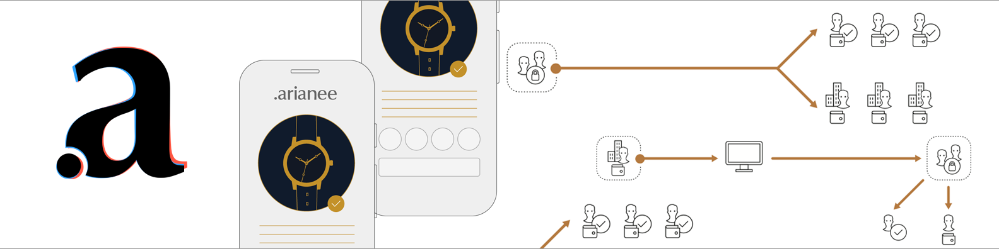

The **Arianee project** is an independent & collaborative association that promotes & provides guidelines and tools to set a **global standard for the digital certification of valuable products**. These guidelines and tools are bundled under the name of the **Arianee protocol**.

 

<h3>Discover</h3> 
Arianee project overview   and key concepts
  
<b><a href="arianeeproject">Read more</a></b>

<h3>How to proceed</h3>
 Step-by-step process   and live demo 
  
<b><a href="howToProceed">Read more</a></b>

<h3>Dig deeper</h3> 
Details about our SDK, standards and smart contracts
  
<b><a href="ArianeeJS">Read more</a></b>

 <i>If you are a developer, reading this documentation and going through the demo should take a couple of hours. No previous knowledge of Blockchain is required. Once you are done, you will know how to manage a certificate on a Blockchain using the Arianee protocol.</i>

